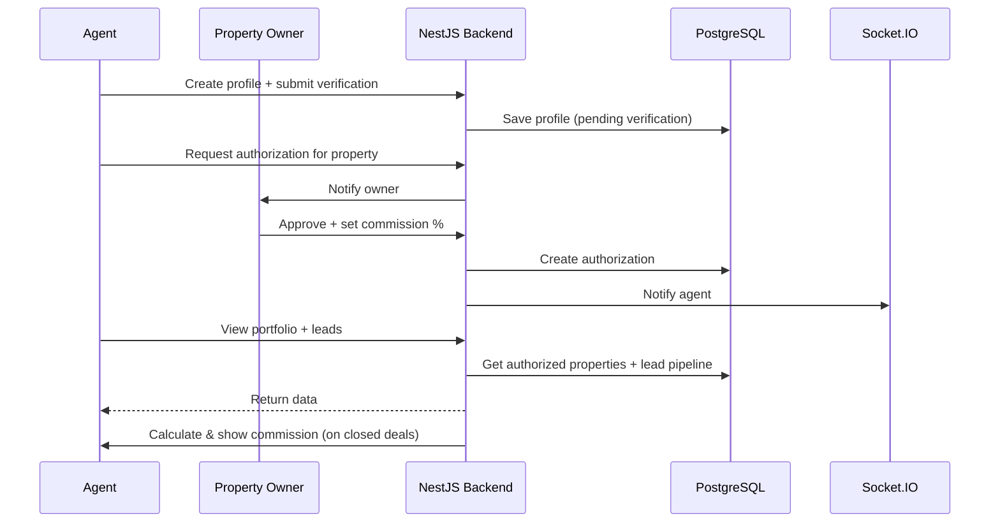

```mermaid
sequenceDiagram
    participant Agent as Agent
    participant Owner as Property Owner
    participant BE as NestJS Backend
    participant DB as PostgreSQL
    participant WS as Socket.IO

    Agent->>BE: Create profile + submit verification
    BE->>DB: Save profile (pending verification)

    Agent->>BE: Request authorization for property
    BE->>Owner: Notify owner
    Owner->>BE: Approve + set commission %
    BE->>DB: Create authorization
    BE->>WS: Notify agent

    Agent->>BE: View portfolio + leads
    BE->>DB: Get authorized properties + lead pipeline
    BE-->>Agent: Return data

    BE->>Agent: Calculate & show commission (on closed deals)
```