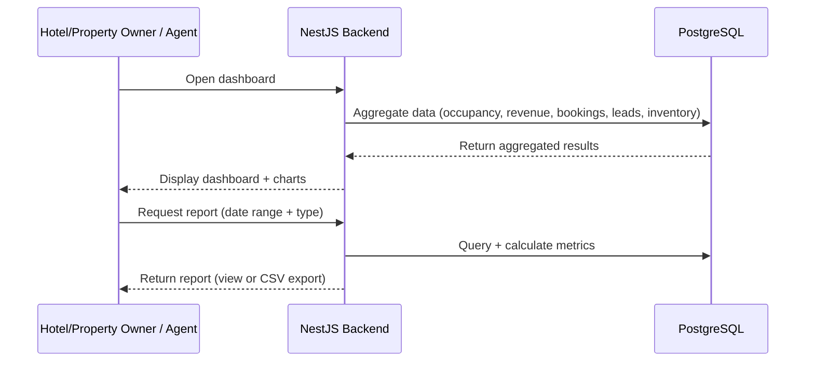

```mermaid
sequenceDiagram
    participant Owner as Hotel/Property Owner / Agent
    participant BE as NestJS Backend
    participant DB as PostgreSQL

    Owner->>BE: Open dashboard
    BE->>DB: Aggregate data (occupancy, revenue, bookings, leads, inventory)
    DB-->>BE: Return aggregated results
    BE-->>Owner: Display dashboard + charts

    Owner->>BE: Request report (date range + type)
    BE->>DB: Query + calculate metrics
    BE-->>Owner: Return report (view or CSV export)
```