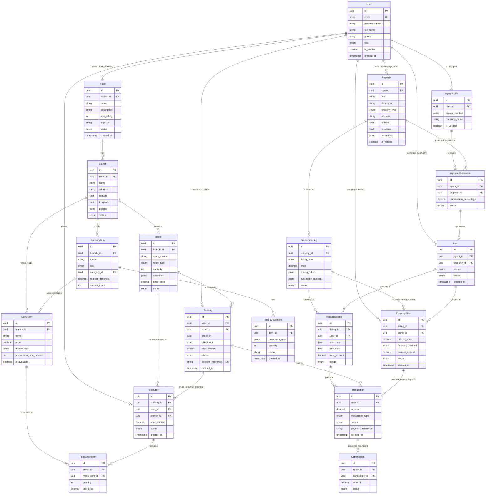

```mermaid
erDiagram
    %% ============================================
    %% LODGIFY EXPANDED HMS - ENTITY RELATIONSHIP DIAGRAM
    %% ============================================

    User ||--o{ Hotel : "owns (as HotelOwner)"
    User ||--o{ Property : "owns (as PropertyOwner)"
    User ||--o{ AgentProfile : "is (as Agent)"
    User ||--o{ Booking : "makes (as Traveler)"
    User ||--o{ FoodOrder : "places"
    User ||--o{ PropertyOffer : "submits (as Buyer)"
    User ||--o{ Lead : "generates (via Agent)"

    Hotel ||--o{ Branch : "has"
    Branch ||--o{ Room : "contains"
    Branch ||--o{ InventoryItem : "stocks"
    Branch ||--o{ MenuItem : "offers (F&B)"

    Room ||--o{ Booking : "is booked in"
    Room ||--o{ FoodOrder : "receives delivery for"

    Property ||--o{ PropertyListing : "is listed as"
    PropertyListing ||--o{ RentalBooking : "is rented via"
    PropertyListing ||--o{ PropertyOffer : "receives offers for (sale)"

    AgentProfile ||--o{ AgentAuthorization : "receives"
    Property ||--o{ AgentAuthorization : "grants authorization to"
    AgentAuthorization ||--o{ Lead : "generates"
    Lead ||--o{ RentalBooking : "converts to"
    Lead ||--o{ PropertyOffer : "converts to"

    InventoryItem ||--o{ StockMovement : "has"
    InventoryItem ||--o{ MenuItem : "used in (recipes)"

    MenuItem ||--o{ FoodOrderItem : "is ordered in"
    FoodOrder ||--o{ FoodOrderItem : "contains"

    Booking ||--o{ FoodOrder : "linked to (in-stay ordering)"

    RentalBooking ||--o{ Transaction : "paid via"
    Booking ||--o{ Transaction : "paid via"
    PropertyOffer ||--o{ Transaction : "paid via (earnest deposit)"

    Transaction ||--o{ Commission : "generates (for Agent)"

    %% ==================== ENTITIES ====================

    User {
        uuid id PK
        string email UK
        string password_hash
        string full_name
        string phone
        enum role
        boolean is_verified
        timestamp created_at
    }

    Hotel {
        uuid id PK
        uuid owner_id FK
        string name
        string description
        int star_rating
        string logo_url
        enum status
        timestamp created_at
    }

    Branch {
        uuid id PK
        uuid hotel_id FK
        string name
        string address
        float latitude
        float longitude
        jsonb policies
        enum status
    }

    Room {
        uuid id PK
        uuid branch_id FK
        string room_number
        enum room_type
        int capacity
        jsonb amenities
        decimal base_price
        enum status
    }

    Booking {
        uuid id PK
        uuid user_id FK
        uuid room_id FK
        date check_in
        date check_out
        decimal total_amount
        enum status
        string booking_reference UK
        timestamp created_at
    }

    Property {
        uuid id PK
        uuid owner_id FK
        string title
        string description
        enum property_type
        string address
        float latitude
        float longitude
        jsonb amenities
        boolean is_verified
    }

    PropertyListing {
        uuid id PK
        uuid property_id FK
        enum listing_type
        decimal price
        jsonb pricing_rules
        jsonb availability_calendar
        enum status
    }

    RentalBooking {
        uuid id PK
        uuid listing_id FK
        uuid user_id FK
        date start_date
        date end_date
        decimal total_amount
        enum status
    }

    PropertyOffer {
        uuid id PK
        uuid listing_id FK
        uuid buyer_id FK
        decimal offered_price
        enum financing_method
        decimal earnest_deposit
        enum status
        timestamp created_at
    }

    AgentProfile {
        uuid id PK
        uuid user_id FK
        string license_number
        string company_name
        boolean is_verified
    }

    AgentAuthorization {
        uuid id PK
        uuid agent_id FK
        uuid property_id FK
        decimal commission_percentage
        enum status
    }

    Lead {
        uuid id PK
        uuid agent_id FK
        uuid property_id FK
        enum source
        enum status
        timestamp created_at
    }

    InventoryItem {
        uuid id PK
        uuid branch_id FK
        string name
        string sku
        uuid category_id FK
        decimal reorder_threshold
        int current_stock
    }

    StockMovement {
        uuid id PK
        uuid item_id FK
        enum movement_type
        int quantity
        string reason
        timestamp created_at
    }

    MenuItem {
        uuid id PK
        uuid branch_id FK
        string name
        decimal price
        jsonb dietary_tags
        int preparation_time_minutes
        boolean is_available
    }

    FoodOrder {
        uuid id PK
        uuid booking_id FK
        uuid user_id FK
        uuid branch_id FK
        decimal total_amount
        enum status
        timestamp created_at
    }

    FoodOrderItem {
        uuid id PK
        uuid order_id FK
        uuid menu_item_id FK
        int quantity
        decimal unit_price
    }

    Transaction {
        uuid id PK
        uuid user_id FK
        decimal amount
        enum transaction_type
        enum status
        string paystack_reference
        timestamp created_at
    }

    Commission {
        uuid id PK
        uuid agent_id FK
        uuid transaction_id FK
        decimal amount
        enum status
    }
```