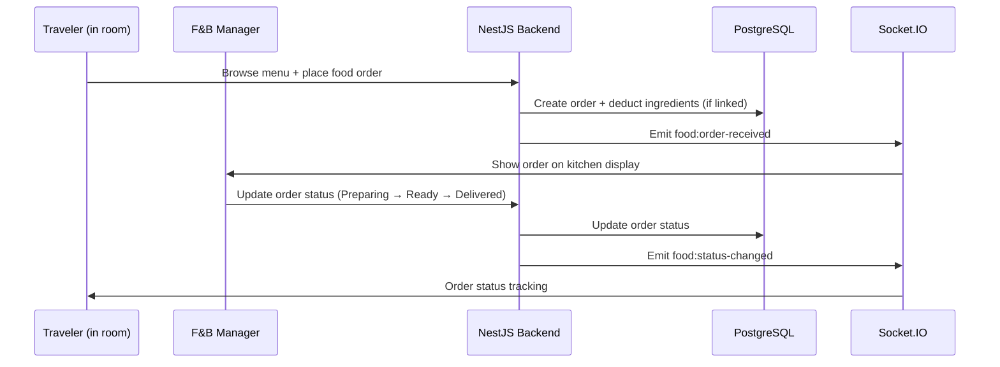

```mermaid
sequenceDiagram
    participant Traveler as Traveler (in room)
    participant Kitchen as F&B Manager
    participant BE as NestJS Backend
    participant DB as PostgreSQL
    participant WS as Socket.IO

    Traveler->>BE: Browse menu + place food order
    BE->>DB: Create order + deduct ingredients (if linked)
    BE->>WS: Emit food:order-received
    WS->>Kitchen: Show order on kitchen display

    Kitchen->>BE: Update order status (Preparing → Ready → Delivered)
    BE->>DB: Update order status
    BE->>WS: Emit food:status-changed
    WS->>Traveler: Order status tracking
```