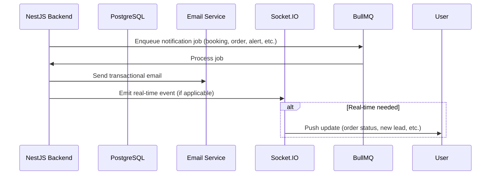

```mermaid
sequenceDiagram
    participant BE as NestJS Backend
    participant DB as PostgreSQL
    participant Email as Email Service
    participant WS as Socket.IO
    participant Q as BullMQ

    BE->>Q: Enqueue notification job (booking, order, alert, etc.)
    Q->>BE: Process job
    BE->>Email: Send transactional email
    BE->>WS: Emit real-time event (if applicable)

    alt Real-time needed
        WS->>User: Push update (order status, new lead, etc.)
    end
```