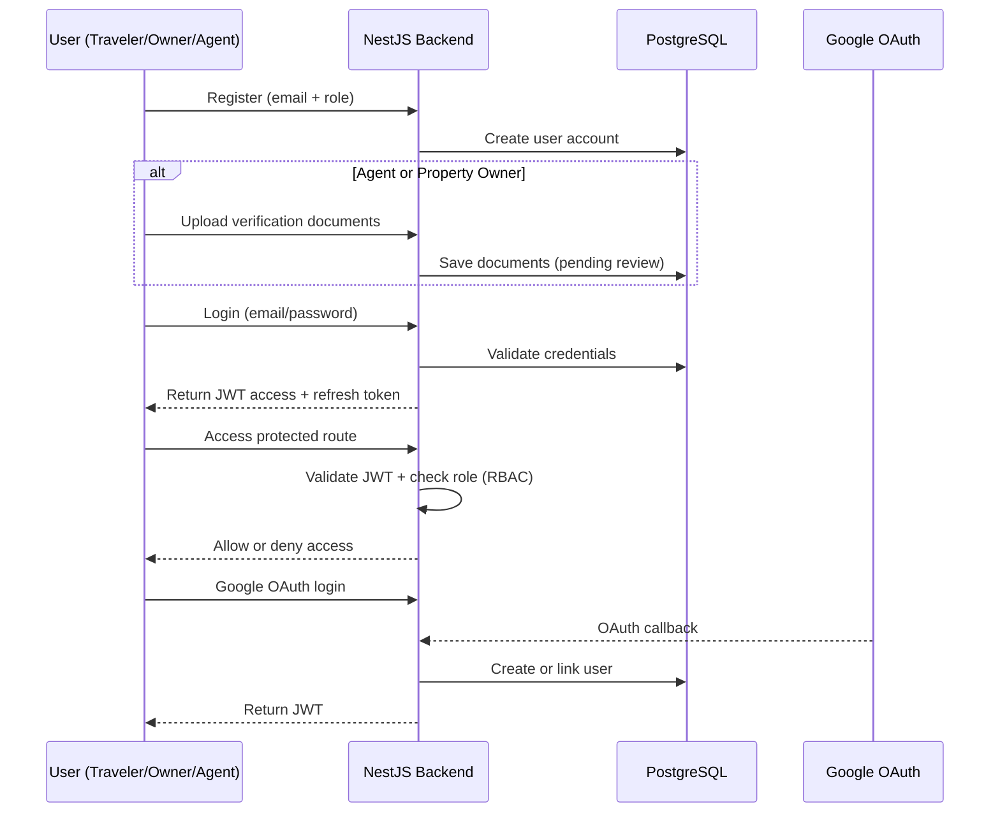

```mermaid
sequenceDiagram
    participant User as User (Traveler/Owner/Agent)
    participant BE as NestJS Backend
    participant DB as PostgreSQL
    participant Google as Google OAuth

    User->>BE: Register (email + role)
    BE->>DB: Create user account
    alt Agent or Property Owner
        User->>BE: Upload verification documents
        BE->>DB: Save documents (pending review)
    end

    User->>BE: Login (email/password)
    BE->>DB: Validate credentials
    BE-->>User: Return JWT access + refresh token

    User->>BE: Access protected route
    BE->>BE: Validate JWT + check role (RBAC)
    BE-->>User: Allow or deny access

    User->>BE: Google OAuth login
    Google-->>BE: OAuth callback
    BE->>DB: Create or link user
    BE-->>User: Return JWT
```