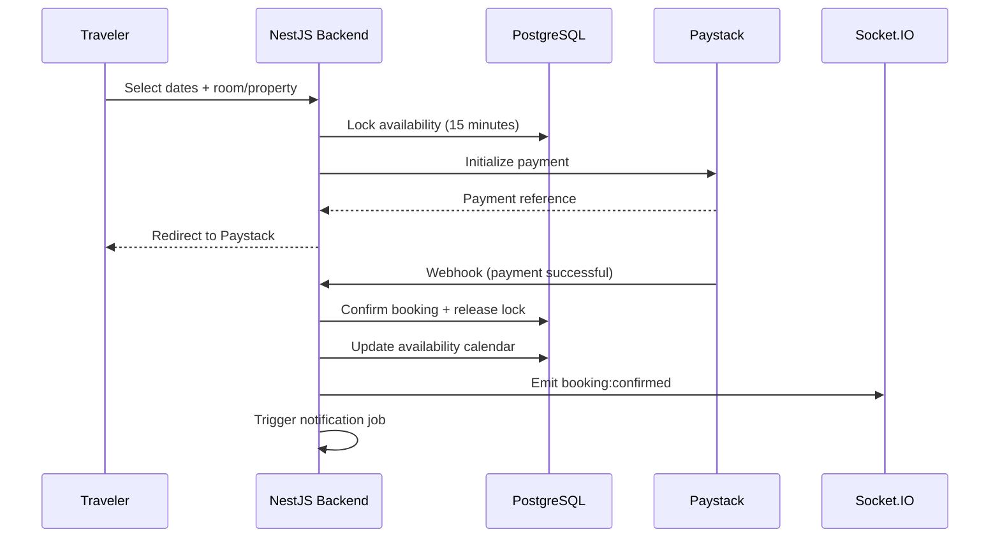

```mermaid
sequenceDiagram
    participant User as Traveler
    participant BE as NestJS Backend
    participant DB as PostgreSQL
    participant Pay as Paystack
    participant WS as Socket.IO

    User->>BE: Select dates + room/property
    BE->>DB: Lock availability (15 minutes)
    BE->>Pay: Initialize payment
    Pay-->>BE: Payment reference
    BE-->>User: Redirect to Paystack

    Pay->>BE: Webhook (payment successful)
    BE->>DB: Confirm booking + release lock
    BE->>DB: Update availability calendar
    BE->>WS: Emit booking:confirmed
    BE->>BE: Trigger notification job
```