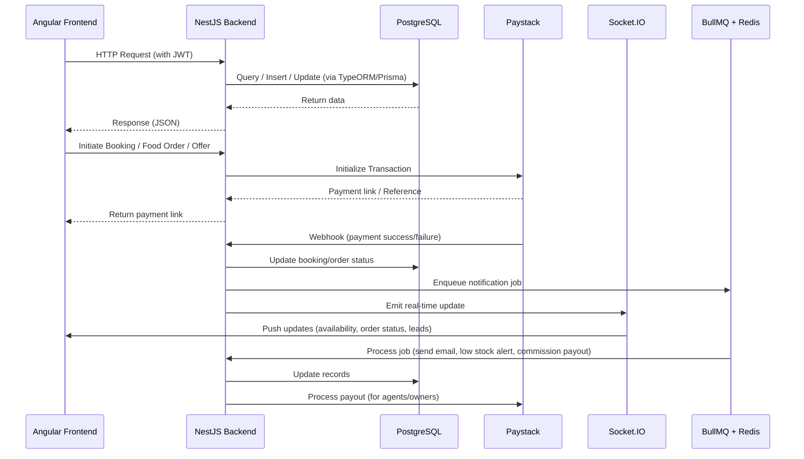

```mermaid
sequenceDiagram
    participant FE as Angular Frontend
    participant BE as NestJS Backend
    participant DB as PostgreSQL
    participant Pay as Paystack
    participant WS as Socket.IO
    participant Q as BullMQ + Redis

    %% Typical Request Flow
    FE->>BE: HTTP Request (with JWT)
    BE->>DB: Query / Insert / Update (via TypeORM/Prisma)
    DB-->>BE: Return data
    BE-->>FE: Response (JSON)

    %% Payment Flow
    FE->>BE: Initiate Booking / Food Order / Offer
    BE->>Pay: Initialize Transaction
    Pay-->>BE: Payment link / Reference
    BE-->>FE: Return payment link
    Pay->>BE: Webhook (payment success/failure)
    BE->>DB: Update booking/order status
    BE->>Q: Enqueue notification job
    BE->>WS: Emit real-time update

    %% Real-time Updates
    WS->>FE: Push updates (availability, order status, leads)

    %% Background Jobs
    Q->>BE: Process job (send email, low stock alert, commission payout)
    BE->>DB: Update records
    BE->>Pay: Process payout (for agents/owners)
```