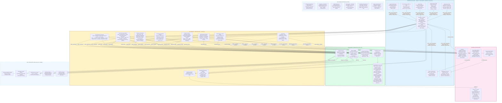

```mermaid
flowchart TD
    %% ============================================================
    %% LODGIFY EXPANDED HMS - COMPONENT INTERACTION ARCHITECTURE
    %% ============================================================

    classDef frontend fill:#e0f2fe,stroke:#0369a1,stroke-width:2px,color:#0c4a6e
    classDef backend fill:#fef3c7,stroke:#b45309,stroke-width:2px,color:#78350f
    classDef data fill:#dcfce7,stroke:#166534,stroke-width:2px,color:#14532d
    classDef realtime fill:#f3e8ff,stroke:#7c3aed,stroke-width:2px,color:#581c87
    classDef external fill:#fce7f3,stroke:#be185d,stroke-width:2px,color:#831843
    classDef flow fill:#f0f9ff,stroke:#0284c8,stroke-width:1px,stroke-dasharray: 3 2

    %% ====================== CLIENT / PRESENTATION LAYER ======================
    subgraph Client ["PRESENTATION LAYER — Angular 17+ SPA (Signals + Standalone Components)"]
        direction TB
        HotelOwnerPortal["Hotel Owner Portal<br/>Dashboard • Occupancy • Revenue • Inventory Alerts<br/>Branch/Room Mgmt • F&amp;B Oversight • Staff Accounts"]
        PropertyOwnerPortal["Property Owner Portal<br/>Listings (Rent/Sale) • Calendar • Agent Authorizations<br/>Offers • Commission Settings • Analytics"]
        AgentPortal["Agent Portal<br/>Portfolio • Leads Pipeline • Viewing Scheduler<br/>Commission Dashboard • Referral Links"]
        TravelerUI["Traveler / Booking Site<br/>Search + Filters • Hotel &amp; Rental Booking<br/>In-stay Food Ordering • Favorites • Reviews"]
        MarketplaceUI["Marketplace &amp; Sales UI<br/>Property Discovery (Rent/Sale) • Map View<br/>Offer Submission • Earnest Deposits • Saved Searches"]
        FoodUI["Food Ordering UI (QR / In-room)<br/>Menu Browser • Cart • Special Instructions<br/>Real-time Order Tracking"]
        AdminPortal["System Admin Portal<br/>Hotel/Property Verification • User Management<br/>Dispute Resolution • Platform Health"]

        HotelOwnerPortal & PropertyOwnerPortal & AgentPortal & TravelerUI & MarketplaceUI & FoodUI & AdminPortal -->|"HTTP + JWT + Interceptors<br/>(Role Guards, Error Handling, Loading States)"| APIGateway
    end

    %% ====================== API & SERVICE LAYER ======================
    subgraph API ["API GATEWAY + SERVICE LAYER — NestJS 10+"]
        direction TB
        APIGateway["Controllers + Guards + Interceptors<br/>RBAC: HotelOwner | BranchManager | PropertyOwner | Agent<br/>Traveler | FoodServiceManager | Admin<br/>JWT (15m access + 7d refresh) • class-validator • Rate Limiting"]
        
        AuthModule["Auth Module<br/>Registration • Login • Password Reset • OAuth (Google)<br/>Agent/Property Owner Verification (docs + admin review)"]
        HotelModule["Hotel &amp; Branch + Room Module<br/>Registration • Multi-branch • Dynamic Pricing • Availability Calendar<br/>Maintenance Scheduling • Amenity Mgmt"]
        BookingModule["Booking Engine Module<br/>Real-time Lock (15min) • Paystack Init • Confirmation<br/>Modification • Cancellation + Refund • Walk-in • Rental Booking"]
        InventoryModule["Inventory Management Module<br/>Categories • Item Master • Stock In/Out • Transfers<br/>Low-stock Alerts • PO Mgmt • Supplier Mgmt • Physical Count"]
        FandBModule["Food &amp; Beverage Module<br/>Menu Categories/Items • Dietary Tags • Kitchen Routing<br/>Order Status (Received→Preparing→Ready→Out for Delivery→Delivered)<br/>Kitchen Inventory Link • Revenue Analytics"]
        PropertyMarketModule["Property Listing &amp; Marketplace Module<br/>Create Listing (Rent/Sale) • Pricing • Availability Calendar<br/>Search + Filters + Map • Detail Page • Reviews • Messaging"]
        AgentModule["Agent Management Module<br/>Profile + Verification • Authorization Requests<br/>Portfolio • Lead Tracking (New→Contacted→Viewing→Negotiating→Closed)<br/>Referral Links • Commission Calculation &amp; Payout"]
        SalesModule["Property Sales Module<br/>Sale Listings • Offer Submission &amp; Negotiation<br/>Sales Pipeline • Earnest Deposit (escrow-style) • Document Vault<br/>Transaction Milestones • Viewing Coordination"]
        NotificationModule["Notification Module<br/>Email (all events) • WebSocket push • In-app alerts"]
        DashboardModule["Dashboard &amp; Reporting Module<br/>Owner / Agent / PropertyOwner / F&amp;B / Inventory views<br/>Exportable reports • Analytics charts"]

        APIGateway --> AuthModule & HotelModule & BookingModule & InventoryModule & FandBModule & PropertyMarketModule & AgentModule & SalesModule & NotificationModule & DashboardModule
    end

    %% ====================== DATA + INFRASTRUCTURE LAYER ======================
    subgraph Data ["DATA ACCESS + INFRASTRUCTURE LAYER"]
        direction TB
        ORM["TypeORM / Prisma Repositories<br/>Repository Pattern • Migrations • Type-safe Queries • JSONB for flexible attrs"]
        
        Postgres[("PostgreSQL 15+ (Core DB)<br/>Users + Roles + Hotels + Branches + Rooms<br/>Inventory: Categories, Items, StockMovements, Suppliers, POs<br/>F&amp;B: MenuCategories, MenuItems, FoodOrders, OrderItems<br/>Marketplace: Properties, Listings, RentalBookings, Offers, Reviews<br/>Agent: Profiles, Authorizations, Leads, Commissions, Viewings<br/>Sales: SaleListings, Offers, Transactions, Documents, Milestones")]
        
        RedisBull[("Redis + BullMQ<br/>• Job Queue (emails, low-stock alerts, commission payouts, reports)<br/>• Pub/Sub for real-time coordination<br/>• Rate-limit + session store")]
        
        GCS[("Google Cloud Storage<br/>Hotel/Property/Room/Food photos (up to 20 per listing)<br/>Documents (title deeds, licenses, surveys)<br/>Signed URLs + CDN")]
        
        SocketServer["Socket.IO Server<br/>Namespaces: /bookings, /kitchen, /agent-portfolio, /marketplace<br/>Rooms per bookingId / propertyId / kitchenId"]

        AuthModule & HotelModule & BookingModule & InventoryModule & FandBModule & PropertyMarketModule & AgentModule & SalesModule -->|"Repository Pattern"| ORM
        ORM --> Postgres
        BookingModule & InventoryModule & FandBModule & AgentModule & SalesModule -->|"enqueueJob()"| RedisBull
        RedisBull -->|"process()"| NotificationModule & DashboardModule
        HotelModule & PropertyMarketModule & FandBModule & SalesModule -->|"upload / signedUrl"| GCS
        BookingModule & FandBModule & PropertyMarketModule & AgentModule -->|"emit() + joinRoom()"| SocketServer
    end

    %% ====================== EXTERNAL SERVICES ======================
    subgraph External ["EXTERNAL INTEGRATIONS"]
        direction TB
        Paystack["Paystack<br/>• Initialize Transaction (bookings, food orders, rental deposits, earnest money, agent commissions)<br/>• Webhook verification (signature + IP whitelist)<br/>• Refunds • Split payouts to owners/agents"]
        
        GoogleMaps["Google Maps Platform<br/>• Geocoding (address → lat/lng + place_id)<br/>• Distance Matrix (search results sorting)<br/>• JavaScript Maps SDK (embedded in Angular UI)"]
        
        EmailService["Gmail API / Google Workspace<br/>Transactional emails only:<br/>Booking confirmations • Food order status • Low-stock alerts<br/>New leads/offers • Commission earned • Password reset • Agent authorization"]
        
        GoogleOAuth["Google Identity Platform<br/>OAuth 2.0 flow for Travelers &amp; Property Seekers (optional social login)"]

        BookingModule & FandBModule & PropertyMarketModule & SalesModule & AgentModule -->|"REST + Signature verification"| Paystack
        Paystack -->|"webhook (verified)"| APIGateway
        HotelModule & PropertyMarketModule & BookingModule -->|"geocode / autocomplete / distance"| GoogleMaps
        GoogleMaps -->|"JS SDK (browser)"| TravelerUI & MarketplaceUI
        NotificationModule -->|"BullMQ job"| EmailService
        AuthModule -->|"OAuth redirect + callback"| GoogleOAuth
    end

    %% ====================== REAL-TIME EVENT FLOWS (KEY) ======================
    subgraph RealtimeFlows ["REAL-TIME EVENT FLOWS (Socket.IO + BullMQ)"]
        direction TB
        BookingEvents["booking:availability-updated<br/>booking:confirmed • booking:cancelled"]
        FoodEvents["food:order-received (kitchen)<br/>food:status-changed (guest + kitchen)<br/>food:ready-for-delivery"]
        InventoryEvents["inventory:low-stock-alert (owner + manager)<br/>inventory:stock-movement"]
        LeadEvents["lead:new-inquiry • lead:viewing-scheduled<br/>lead:offer-submitted • commission:earned"]
        SalesEvents["sale:offer-received • sale:counter-offer<br/>sale:milestone-updated • sale:closed"]

        SocketServer --> BookingEvents & FoodEvents & InventoryEvents & LeadEvents & SalesEvents
        RedisBull -->|"delayed / recurring jobs"| InventoryEvents & LeadEvents
    end

    %% ====================== LEGEND / NOTES ======================
    subgraph Legend ["KEY DESIGN PRINCIPLES (from PRD)"]
        direction TB
        Note1["• All payments (bookings, food, deposits, commissions, earnest) go through Paystack with webhook verification"]
        Note2["• Real-time = Socket.IO (availability, kitchen orders, leads). Everything else = REST + BullMQ background jobs"]
        Note3["• RBAC enforced at controller/guard level. Every module respects role-based routes and data visibility"]
        Note4["• File uploads → GCS with signed URLs. Never direct public access to documents (only verified buyers/agents)"]
        Note5["• Inventory auto-deducts on room clean + food order (recipe linking). Low-stock triggers email + dashboard alert"]
        Note6["• Agent commission auto-calculated on closed booking/sale → BullMQ job → Paystack payout on owner approval"]
    end

    %% ====================== STYLING ======================
    class Client frontend
    class API backend
    class Data data
    class External external
    class RealtimeFlows flow
    class Legend flow
```