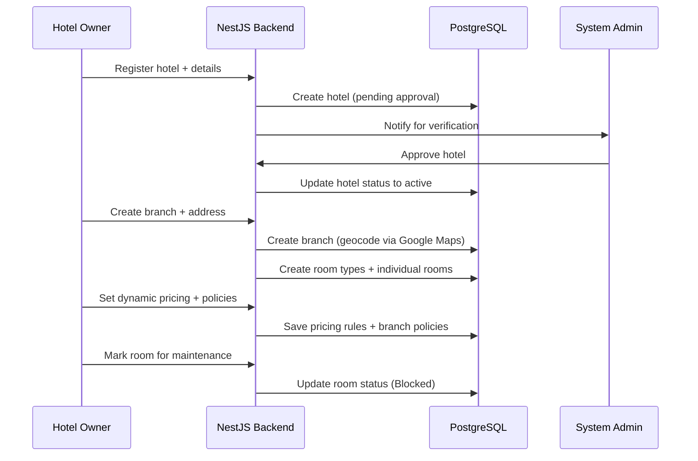

```mermaid
sequenceDiagram
    participant Owner as Hotel Owner
    participant BE as NestJS Backend
    participant DB as PostgreSQL
    participant Admin as System Admin

    Owner->>BE: Register hotel + details
    BE->>DB: Create hotel (pending approval)
    BE->>Admin: Notify for verification

    Admin->>BE: Approve hotel
    BE->>DB: Update hotel status to active

    Owner->>BE: Create branch + address
    BE->>DB: Create branch (geocode via Google Maps)
    BE->>DB: Create room types + individual rooms

    Owner->>BE: Set dynamic pricing + policies
    BE->>DB: Save pricing rules + branch policies

    Owner->>BE: Mark room for maintenance
    BE->>DB: Update room status (Blocked)
```