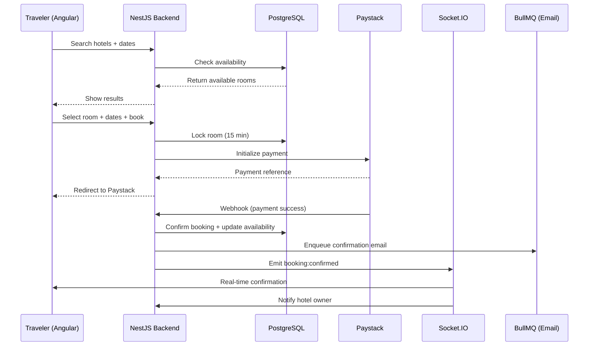

```mermaid
sequenceDiagram
    participant Traveler as Traveler (Angular)
    participant BE as NestJS Backend
    participant DB as PostgreSQL
    participant Pay as Paystack
    participant WS as Socket.IO
    participant Q as BullMQ (Email)

    Traveler->>BE: Search hotels + dates
    BE->>DB: Check availability
    DB-->>BE: Return available rooms
    BE-->>Traveler: Show results

    Traveler->>BE: Select room + dates + book
    BE->>DB: Lock room (15 min)
    BE->>Pay: Initialize payment
    Pay-->>BE: Payment reference
    BE-->>Traveler: Redirect to Paystack

    Pay->>BE: Webhook (payment success)
    BE->>DB: Confirm booking + update availability
    BE->>Q: Enqueue confirmation email
    BE->>WS: Emit booking:confirmed
    WS->>Traveler: Real-time confirmation
    WS->>BE: Notify hotel owner
```