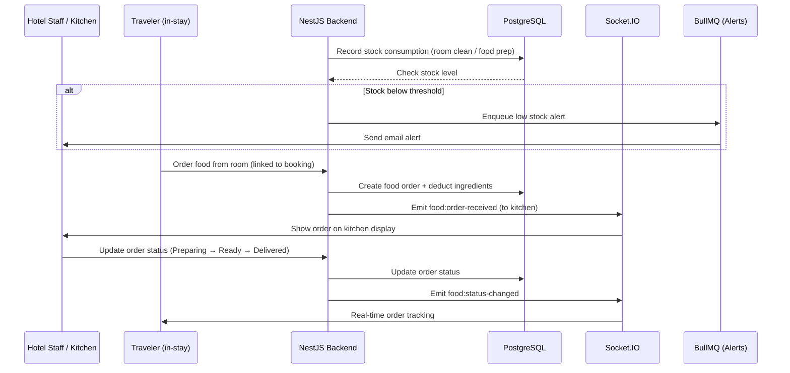

```mermaid
sequenceDiagram
    participant Staff as Hotel Staff / Kitchen
    participant Traveler as Traveler (in-stay)
    participant BE as NestJS Backend
    participant DB as PostgreSQL
    participant WS as Socket.IO
    participant Q as BullMQ (Alerts)

    %% Inventory Low Stock
    BE->>DB: Record stock consumption (room clean / food prep)
    DB-->>BE: Check stock level
    alt Stock below threshold
        BE->>Q: Enqueue low stock alert
        Q->>Staff: Send email alert
    end

    %% Food Ordering Flow
    Traveler->>BE: Order food from room (linked to booking)
    BE->>DB: Create food order + deduct ingredients
    BE->>WS: Emit food:order-received (to kitchen)
    WS->>Staff: Show order on kitchen display

    Staff->>BE: Update order status (Preparing → Ready → Delivered)
    BE->>DB: Update order status
    BE->>WS: Emit food:status-changed
    WS->>Traveler: Real-time order tracking
```