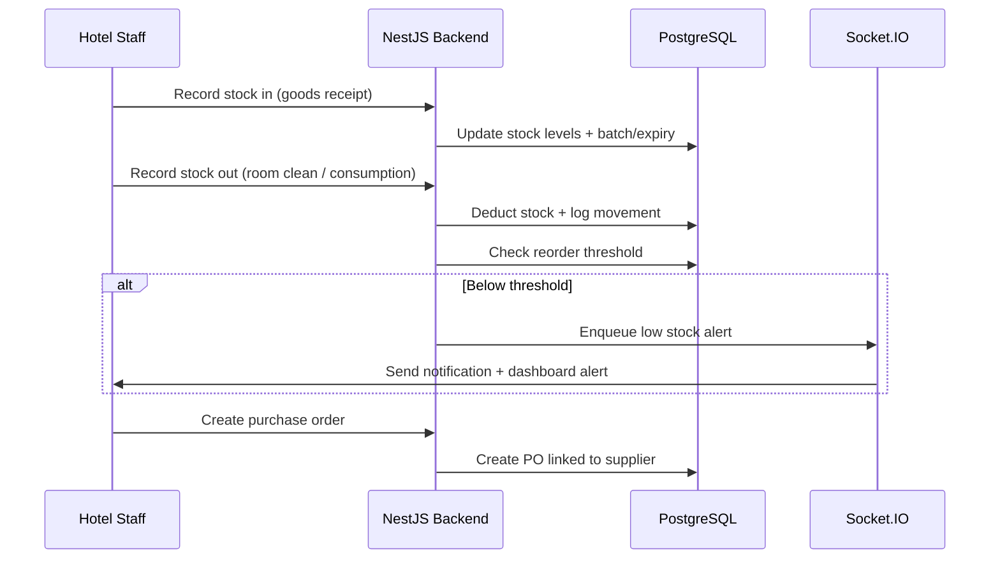

```mermaid
sequenceDiagram
    participant Staff as Hotel Staff
    participant BE as NestJS Backend
    participant DB as PostgreSQL
    participant Q as Socket.IO

    Staff->>BE: Record stock in (goods receipt)
    BE->>DB: Update stock levels + batch/expiry

    Staff->>BE: Record stock out (room clean / consumption)
    BE->>DB: Deduct stock + log movement
    BE->>DB: Check reorder threshold

    alt Below threshold
        BE->>Q: Enqueue low stock alert
        Q->>Staff: Send notification + dashboard alert
    end

    Staff->>BE: Create purchase order
    BE->>DB: Create PO linked to supplier
```