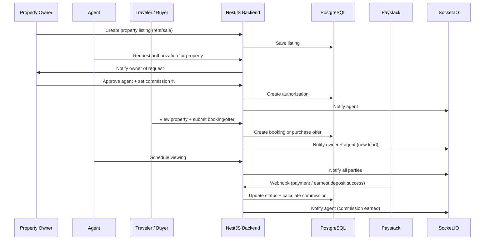

```mermaid
sequenceDiagram
    participant Owner as Property Owner
    participant Agent as Agent
    participant Traveler as Traveler / Buyer
    participant BE as NestJS Backend
    participant DB as PostgreSQL
    participant Pay as Paystack
    participant WS as Socket.IO

    Owner->>BE: Create property listing (rent/sale)
    BE->>DB: Save listing

    Agent->>BE: Request authorization for property
    BE->>Owner: Notify owner of request
    Owner->>BE: Approve agent + set commission %
    BE->>DB: Create authorization
    BE->>WS: Notify agent

    Traveler->>BE: View property + submit booking/offer
    BE->>DB: Create booking or purchase offer
    BE->>WS: Notify owner + agent (new lead)

    Agent->>BE: Schedule viewing
    BE->>WS: Notify all parties

    Pay->>BE: Webhook (payment / earnest deposit success)
    BE->>DB: Update status + calculate commission
    BE->>WS: Notify agent (commission earned)
```