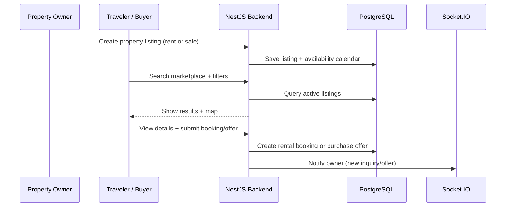

```mermaid
sequenceDiagram
    participant Owner as Property Owner
    participant User as Traveler / Buyer
    participant BE as NestJS Backend
    participant DB as PostgreSQL
    participant WS as Socket.IO

    Owner->>BE: Create property listing (rent or sale)
    BE->>DB: Save listing + availability calendar

    User->>BE: Search marketplace + filters
    BE->>DB: Query active listings
    BE-->>User: Show results + map

    User->>BE: View details + submit booking/offer
    BE->>DB: Create rental booking or purchase offer
    BE->>WS: Notify owner (new inquiry/offer)
```