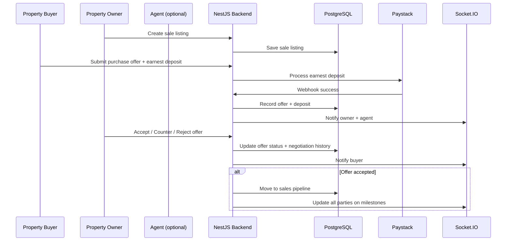

```mermaid
sequenceDiagram
    participant Buyer as Property Buyer
    participant Owner as Property Owner
    participant Agent as Agent (optional)
    participant BE as NestJS Backend
    participant DB as PostgreSQL
    participant Pay as Paystack
    participant WS as Socket.IO

    Owner->>BE: Create sale listing
    BE->>DB: Save sale listing

    Buyer->>BE: Submit purchase offer + earnest deposit
    BE->>Pay: Process earnest deposit
    Pay->>BE: Webhook success
    BE->>DB: Record offer + deposit
    BE->>WS: Notify owner + agent

    Owner->>BE: Accept / Counter / Reject offer
    BE->>DB: Update offer status + negotiation history
    BE->>WS: Notify buyer

    alt Offer accepted
        BE->>DB: Move to sales pipeline
        BE->>WS: Update all parties on milestones
    end
```