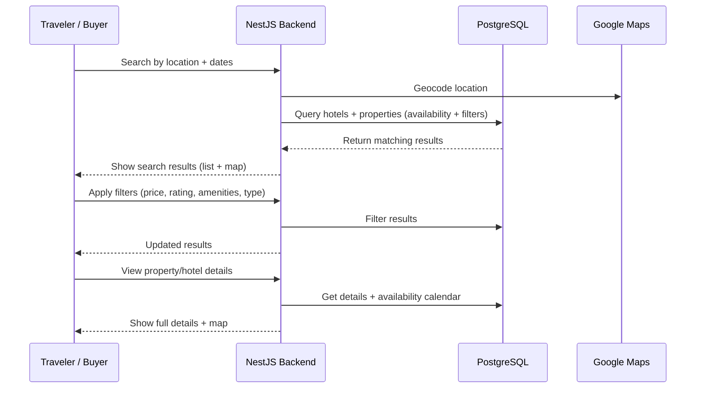

```mermaid
sequenceDiagram
    participant User as Traveler / Buyer
    participant BE as NestJS Backend
    participant DB as PostgreSQL
    participant Maps as Google Maps

    User->>BE: Search by location + dates
    BE->>Maps: Geocode location
    BE->>DB: Query hotels + properties (availability + filters)
    DB-->>BE: Return matching results
    BE-->>User: Show search results (list + map)

    User->>BE: Apply filters (price, rating, amenities, type)
    BE->>DB: Filter results
    BE-->>User: Updated results

    User->>BE: View property/hotel details
    BE->>DB: Get details + availability calendar
    BE-->>User: Show full details + map
```